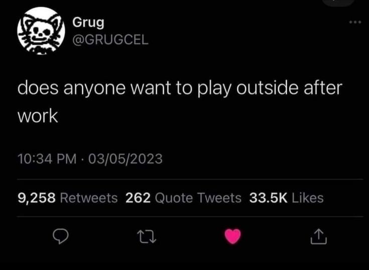
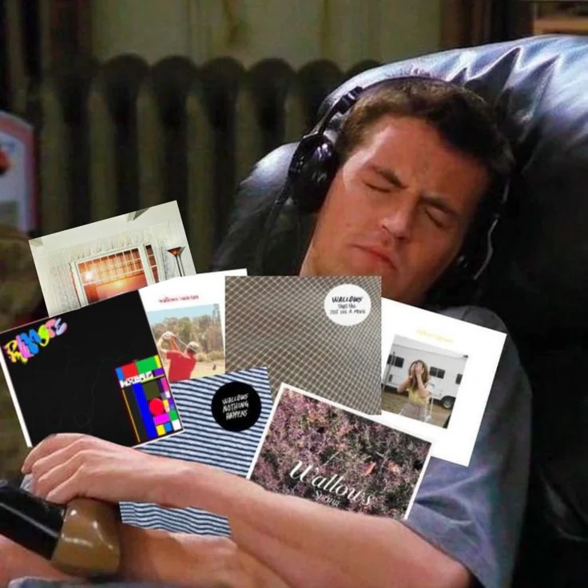
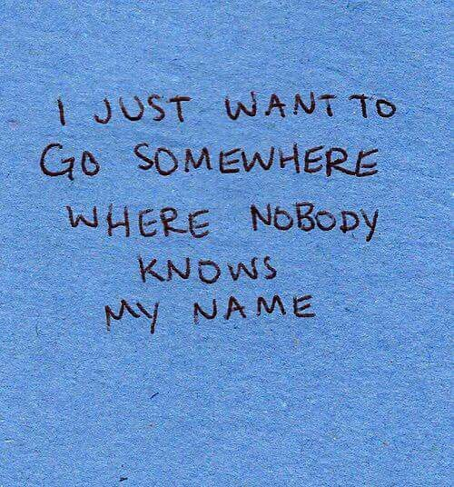
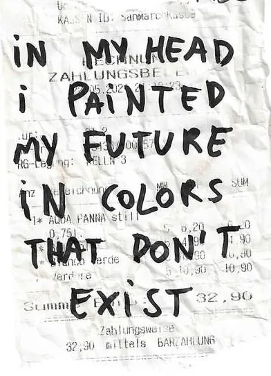

# Scraps

You don't force yourself to paint a masterpiece. You become the kind of person who paints masterpieces, then you simply paint.

---

> "In the future... if by some miracle you ever find yourself in the position to fall in love again... fall in love with me."
>
> -- Colleen Hoover, It Ends with Us

---

> "Despite the fact that you have the most freedom you've ever had in your life yet you feel the loneliest."
>
> -- Some TikTok about college

---

> "I become a generalist by default for my incessant need to understand."
>
> -- @k0ncept, X

---

> "You rate a man by what he has made of his family and not his businesses."
>
> -- Rev. Olusola Areogun

---

> "Social media got regular people thinking they're too good for regular people."
>
> -- Rhino, loveliveserve

---

"Internally distracted"

---

> "I think the reward for conformity is that everyone likes you except yourself."
>
> -- Rita Mae Brown

---

> "How we spend our days is, of course, how we spend our lives."
>
> -- Annie Dillard, The Writing Life

---

Already felt everything I'll ever feel. Nothing new waiting on the other side.

---

> "You pray to catch the bus and then you run as fast as you can."
>
> -- Kerry Washington

---

"Curiouser mind"

---

We're all imperfect people searching for perfection in others.

---

I'm home sick for a city I never lived in

---

We work to afford lives we barely have time to live. The trap is elegant in its cruelty.

---

"wasted potential"

---

> "Nostalgia for futures that never happened"
>
> -- Some TikTok comment

---

Never fully awake, never truly asleep.

---

> "We accept the love we think we deserve."
>
> -- Stephen Chbosky, The Perks of Being a Wallflower

---

"Fearing the natural state of progress."

---

"weaponized autism"

---

> "Righteousness without power is just an opinion"
>
> -- Valentina Allegra de Fontaine, Thunderbolts

---

"Confirmation bias"

---

"Solitude isn't loneliness"

---

"Hedonic treadmill"

---

"Self-distract not self-sabotage"

"Earnestness over composure"

"Micro failures that teach grit"

---

> "The view from half way down"
>
> -- Alison Tafel, BoJack Horseman

---

> "The agenda is in my head"
>
> -- Thomas Shelby, Peaky Blinders

---

"Organized chaos"

---

I've never learned to achieve things through self-love or self-compassion. My only language is obsession, my only fuel is burning myself down to build something up.

---

> "Your worst sin is that you have destroyed and betrayed yourself for nothing."
>
> -- Fyodor Dostoevsky, Crime and Punishment

---

My greatest sin is that I keep feeding behaviors I promised myself I would starve, and starve the behaviors I promised myself I would feed.

---

a transition from being a student of someone else’s curriculum to being the architect of your own.

---

---

---

---

